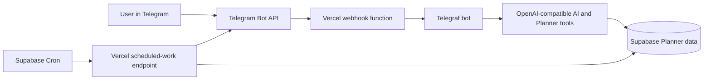

# Planner AI Assistant

An AI-powered Telegram interface for an existing personal planner. The assistant reads and updates Planner data in Supabase, so the web app and Telegram bot work with the same account and records.

> This repository contains the Telegram assistant and its deployment configuration. The Planner web application is a separate project and remains the source of truth for planner data.

## What it can do

Talk to the bot in natural language after connecting your Planner account. It can use the following Planner actions:

### Read your plan

- Show today's events, tasks, overdue tasks, and habit check-ins.
- List tasks by status or time range: open, due today, overdue, future, or all.
- Show events over a date range, including occurrences of recurring events.
- Show habits and completion history for a selected date.
- Summarize a week of events, tasks, and habits.
- Read ideas saved in Planner, with archived ideas included only when requested.

### Update Planner from Telegram

- **Tasks:** create tasks with an optional note, deadline, and low/medium/high priority; edit them; mark them complete; or delete them.
- **Events:** create and edit calendar events with a title, start/end time, and color. Daily, weekly, monthly, and yearly recurrence is supported with an end date. Events can also be deleted.
- **Habits:** mark an existing habit complete for a date or undo that completion. The bot does not create or rename habits.
- **Ideas:** save ideas, view them, change their title or category, archive or restore them, and delete them.
- **Reminders:** create one-time reminders for a future date and time, or cancel a reminder that has not been sent.
- **Deletion safety:** deleting a task, event, or idea requires a separate confirmation in Telegram. Use `/cancel` to cancel a pending deletion or pairing flow.

The assistant uses a constrained set of typed tools to perform Planner operations. It does not expose arbitrary database queries to the language model.

For example, after linking you can ask “Что у меня сегодня?”, “Покажи задачи на следующую неделю”, “Добавь задачу позвонить врачу завтра с высоким приоритетом”, or “Напомни мне отправить отчёт сегодня в 18:00”. The model can ask a follow-up question when required details, such as an event time, are missing.

## How it works

### Account linking

1. The user signs in to Planner and opens **Profile → Create connection code**.
2. Planner generates a random one-time code and asks Supabase to store only its SHA-256 hash for the signed-in user. The code expires after 10 minutes; a new code can be issued at most once per minute.
3. The user sends `/start` to the Telegram bot and submits the code.
4. A server-only Supabase function validates and consumes the code atomically, then records the Telegram ID to Supabase user ID mapping in `telegram_users`.
5. Each Planner tool resolves the linked Supabase user ID and scopes its database operations to that user's records. The link is one Planner account per Telegram account and one Telegram account per Planner account.

No email or SMTP setup is needed for Telegram linking. The Planner browser uses its public Supabase key for the signed-in user's pairing request; the bot uses the Supabase secret key only on the server to consume a code and perform Planner operations.

### Assistant requests

Natural-language messages are sent to the configured OpenAI-compatible API. The model can select only declared Planner tools; each tool validates inputs and performs a scoped Supabase operation. Destructive task, event, and idea deletions are held for a separate user confirmation. Dates and event recurrences are interpreted using the configured planner timezone.

The bot does not provide a separate `/help` command. Start or restart the conversation with `/start`; if the Telegram session was reset, the bot restores the existing account link from Supabase. Send `/cancel` while a pairing code or deletion confirmation is pending to abandon that step.

### Reminders and morning summaries

Reminders are stored in Supabase and delivered by scheduled work. Supabase Cron calls the protected Vercel endpoint once per minute; the job checks for reminders that are due and sends only those. It does not send a notification just because a minute has passed. Reminder claims prevent concurrent workers from sending the same item twice.

An optional morning summary can report today's events and tasks, overdue tasks, and habit progress. It is disabled unless `MORNING_SUMMARY_ENABLED=true`. Delivery time and timezone are configurable. The summary is assembled from Planner data; it does not require a separate AI request.

## Data and access boundaries

- Supabase is the source of truth. The assistant works with the Planner's existing `tasks`, `events`, `habits`, and `habit_completions` tables, plus the `telegram_users` account-link table.
- Optional features use their own supporting tables, such as `ideas`, `reminders`, summary delivery records, and webhook session/receipt storage.
- Planner tools look up the Supabase user ID through `telegram_users` and scope reads, updates, and deletes to that ID.
- The service-role secret is used only by server-side code. Because it is a privileged key, the typed tools must continue to scope every user operation by the linked `user_id`. Never expose the key to browser code, commit it, or send it in chat.
- PostgreSQL table grants are also required: bypassing RLS does not grant SQL privileges by itself. The pairing SQL proposal grants the bot access to `telegram_users`, `tasks`, `events`, `habits`, and `habit_completions` while leaving RLS enabled.
- `.env.local` and other local environment files are excluded by `.gitignore`; `.env.example` contains names and placeholders only.

The SQL files under [`schema-proposals/`](schema-proposals/) are deployment and feature setup scripts. Review each against the target Supabase project before applying it; do not run them against an unrelated project.

## Project structure

| Path | Purpose |
| --- | --- |
| `bot.js` | Telegraf bot, account linking, message handling, and tool registration |
| `ai-assistant.js`, `ai-tools.js` | AI orchestration, tool definitions, confirmation flow, and safe tool dispatch |
| `read-tools.js` | Planner reads, date/timezone handling, weekly views, and recurring event expansion |
| `task-tools.js`, `event-tools.js`, `habit-tools.js` | Validated task, event, and habit operations |
| `idea-tools.js`, `reminder-tools.js` | Idea and one-time reminder operations |
| `scheduler.js`, `morning-summary.js` | Due reminder delivery and optional morning summaries |
| `api/telegram.mjs` | Vercel Telegram webhook endpoint and update de-duplication |
| `api/cron.mjs` | Protected scheduled-work endpoint and webhook receipt cleanup |
| `supabase-session-store.js` | Persistent Telegram session storage for serverless webhook runs |
| `scripts/set-webhook.js` | Registers the deployed endpoint with Telegram |
| `schema-proposals/` | SQL for optional tables and Supabase Cron setup |

## Run locally

### Requirements

- Node.js 22 or later.
- A Telegram bot token.
- An OpenAI API key or credentials for a compatible API.
- A Supabase project with the Planner schema and account-link table.

### Setup

1. Install packages: `npm install`.
2. Copy `.env.example` to `.env.local`.
3. Fill the local file with the required environment values listed below. Keep it out of Git.
4. Start the bot in polling mode: `node bot.js`.

Polling mode is for local development. A deployed Vercel instance receives updates through the Telegram webhook instead.

Run the automated tests with `npm test`.

## Deploy to Vercel Hobby

The repository is configured for Vercel Node.js Functions. Telegram updates arrive at `api/telegram.mjs`. Scheduled work runs through `api/cron.mjs`, called by Supabase Cron; this avoids relying on Vercel Hobby's once-daily scheduled function limit.

1. Import this GitHub repository into Vercel and deploy it as a Node.js project.
2. In Vercel Project Settings → Environment Variables, configure the required secrets and `TELEGRAM_SESSION_STORE=supabase`.
3. Apply [`schema-proposals/telegram-pairing.sql`](schema-proposals/telegram-pairing.sql) to the Planner Supabase project. It creates short-lived pairing-code functions, required unique indexes, and server-role grants for the Planner tables used by the bot. Keep RLS enabled.
4. Apply [`schema-proposals/vercel-webhook-storage.sql`](schema-proposals/vercel-webhook-storage.sql) if it has not already been applied. It creates protected session and webhook receipt storage.
5. Register the deployed `/api/telegram` URL with Telegram using `npm run set-webhook` from a local environment configured with the webhook URL and webhook secret.
6. Add the Vercel cron endpoint URL and matching `CRON_SECRET` to Supabase Vault, then review and run [`schema-proposals/vercel-minute-cron.sql`](schema-proposals/vercel-minute-cron.sql) in the Supabase SQL Editor.
7. If morning summaries are wanted, enable them in Vercel environment settings and configure the schedule.

Do not put secret values in this README, GitHub, screenshots, or chat. Enter them only in the local ignored `.env.local` file or the relevant provider's secret settings.

## Environment variables

| Variable | Required | Purpose |
| --- | --- | --- |
| `TELEGRAM_BOT_TOKEN` | Yes | Telegram bot API access |
| `OPENAI_API_KEY` | Yes | AI provider authentication |
| `SUPABASE_URL` | Yes | Supabase project URL |
| `SUPABASE_SECRET_KEY` | Yes, server only | Privileged server-side Planner operations |
| `OPENAI_BASE_URL` | No | Override the default OpenAI API endpoint for a compatible provider |
| `OPENAI_MODEL` | No | Model name; see `.env.example` for the configured default |
| `TELEGRAM_SESSION_STORE` | Vercel webhook | Set to `supabase` for persistent serverless sessions |
| `TELEGRAM_WEBHOOK_SECRET` | Vercel webhook | Verifies Telegram webhook requests |
| `TELEGRAM_WEBHOOK_URL` | Local webhook setup | Public HTTPS URL of the deployed `/api/telegram` endpoint |
| `CRON_SECRET` | Scheduled work | Shared secret protecting `/api/cron` |
| `PLANNER_TIMEZONE` | No | Planner timezone; defaults to `Europe/Moscow` |
| `MORNING_SUMMARY_ENABLED` | No | Enable optional morning summaries; defaults to `false` |
| `MORNING_SUMMARY_HOUR` | No | Local delivery hour; defaults to `8` |
| `MORNING_SUMMARY_MINUTE` | No | Local delivery minute; defaults to `0` |
| `MORNING_SUMMARY_WINDOW_MINUTES` | No | Delivery window; defaults to `60` minutes |
| `REMINDER_BATCH_SIZE` | No | Maximum due reminders handled in one run; defaults to `50` |

## License

No license has been added. The repository is publicly viewable, but no open-source reuse rights are granted unless a license is added.
